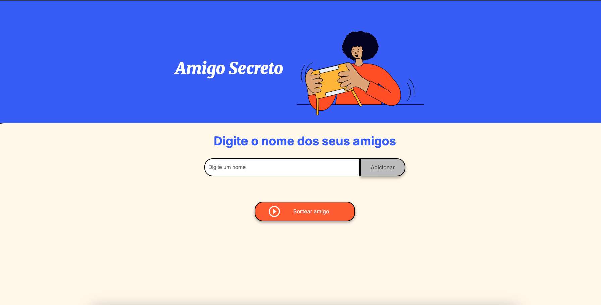
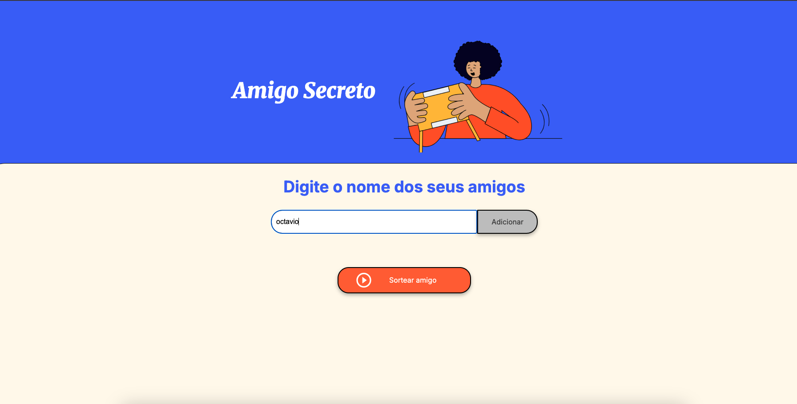
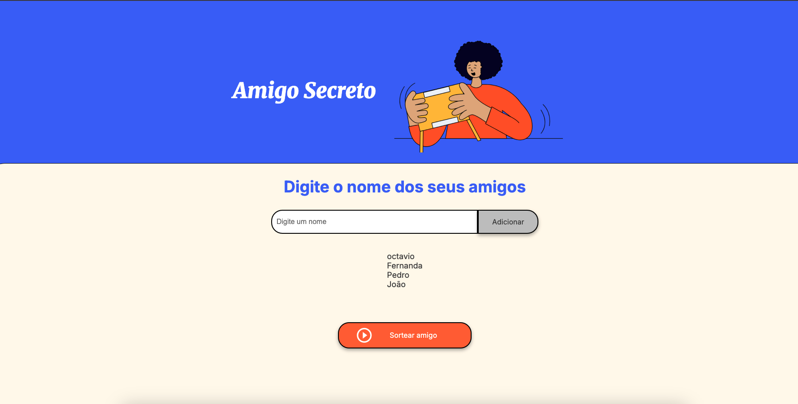
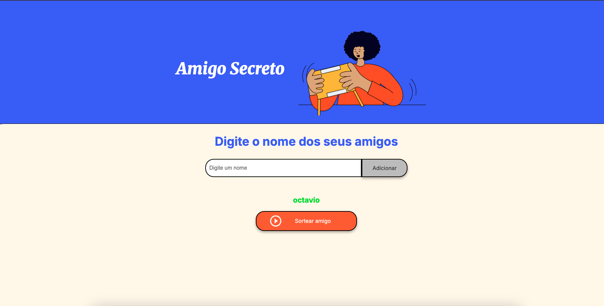
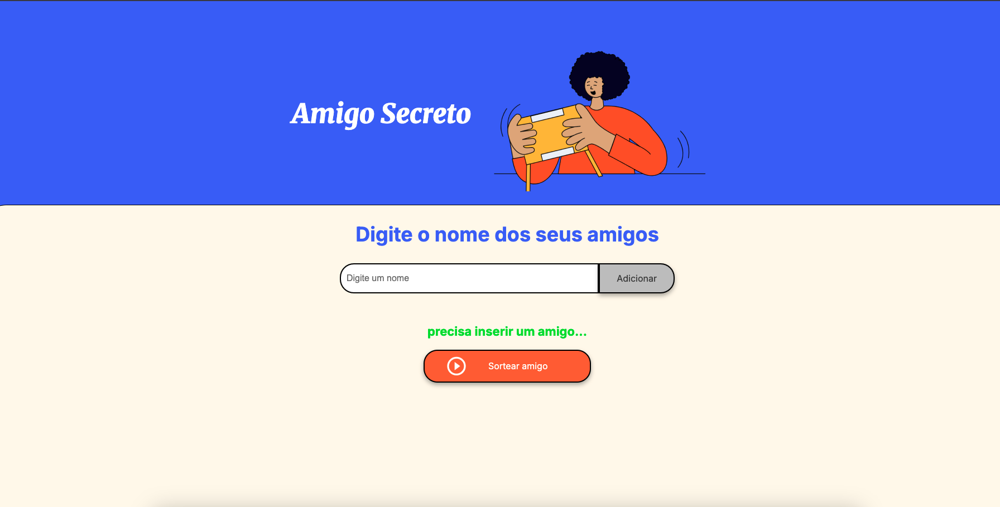

# friend-secret
Desenvolvido em HTM, CSS e JS esse projeto consiste em uma ferramenta que recebe do usuário 4 nomes e sorteia um nome dentre os escolhidos. 

<b>
# Screenshots
  
<!-- You can add more screenshots here if you like -->
&emsp;&emsp;; ; 

# 📲 Como Acessar o Aplicativo
Link: Adiconar Link do versel 

#  Nativo no Aplicativo:
O aplicativo possui: 
	- campo para digitar um nome por vez; 
	- botão do lado direito do campo para digitar o nome chamado 'Adicionar'; e 
	- botão abaixo chamado 'Sortear Amigo'. 

 # Como Utilizar o Aplicativo
Siga os passos abaixo para lograr êxito na utilização e no resultado desejado. 
       1. Preencha com o nome da pessoa no campo 'Digite um Nome'. Campo em branco não funciona; 
       2. Depois click no botão 'Adicionar', após cliecar voce vai notar o nome abaixo - Sendo esse resultado para o nome foi inserido na lista; 
       3. Repita o passo 1. e 2. até atingir a quantidade de participantes desejada;  
       4. Click no botão 'Sortear Amigo' para que a ferramenta selecione o Amigo Secreto de forma aleatoria.

# Tecnologias Utilizadas Nesse projeto
* HTML
* CSS
* JavaScript
  - arrays;
  - variáveis;
  - condicionais;
  - funções; 
 

# A fazer
- Aprimorar a estilização do Site tornando mais aperfeiçoado no ponto de vista do design.

## Produzido por: 
Octavio Augusto de Melo Pereira Dias
